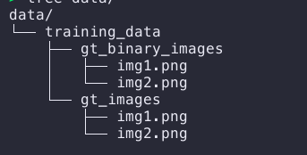
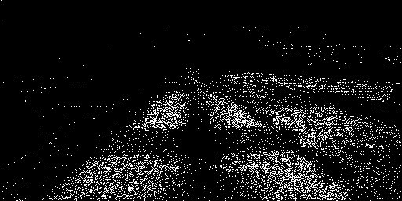
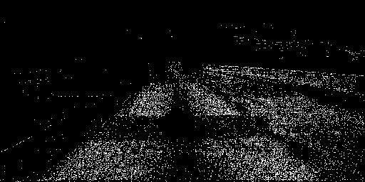
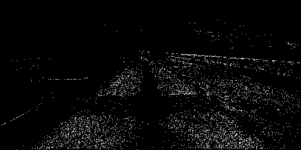
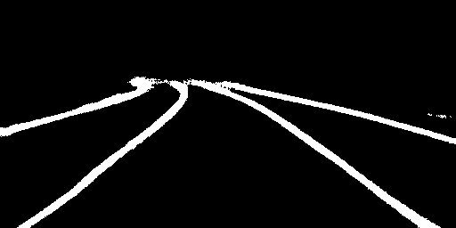

# Lane Detection 
In Autonomous driving vehicle systems,  lane detection is one the most crucial step. In most Level 3 & Level 4 autonomous vehicle systems,  where few features set should be satisfied before operation take control of the vehicle.  Lane detection is a problem that needs to be solved very reliably & correctly as this is the essential building block of any Autonomous Driving systems. 

In the following section, we are discussing traditional approaches for Lane detection. Before moving towards the techniques that can be used for Lane detection, first, we need to understand if the RGB cameras are good enough to capture the features to identify the lanes. Lane's in themself are not that feature-rich, most of the marking will be similar & it has proven that in controlled conditions, we can surely detect these lanes using algorithms. So the data gathering process using standard cameras should work as expected.

### Traditional Methods
These methods rely heavily on handcrafted features and heuristics to identify the lane segments. Most popular among these are color-based features, the structure-based, bar filters, ridge features, etc. which are then mostly combined with a Hough transform for the lane identification. Then other methods are used for post-processing for a better approximation of lane segments.
As mentioned in the above section, these methods work in a controlled scene, and they have many flaws when it comes to robustness issues due to road scene variations. 

### Machine Learning Methods
With the latest development in Machine Learning field, these probabilistic data-driven methods work very well compared with traditional methods. Instead of handcrafted features, automated feature extraction based on data. Mostly this feature extraction is performed using Deep Neural Network. There are multiple ways to frame this problem & solution can be built using different types of Neural networks such as CNN, RNN, Encoders, etc. 

As in this newer advances deciding how to frame a problem is more critical than the techniques in itself.  Some of the research present this problem as pixel-wise lane segmentation,  CNN based classification, multi-task Recurrent Neural Net, etc. 

### Proposed Solution 

#### Data

Before deciding on the solution, understanding the data is a crucial part. For this problem statement, we have input as scene images in RGB color space and Binary Segmented images as Labels. 
This problem should be tackled using segmentation methods with the binary classification of each pixel of the image.

#### Lane Segmentation 
This network has two classes lane and background. Each pixel in the image is predicted between these two classes. This segmentation network is trained using standard cross-entropy loss function.

#### Network Architecture 
Based on Learning Deconvolution Network for Semantic Segmentation work, we can use the pre-trained VGG network to extract the representation of the image for semantic segmentation. 
Network architecture is based on the encoder-decoder network(ENet) mentioned in the above work. This network is trained for the generation of single-channel(binary) label images at the end.

#### Training

##### Input Folder Structure:
<p align="center">

</p>

##### Generate TF records for Data
```python
python data_provider/data_feed_pipline.py  --dataset_dir data/training_data_example/ --tfrecords_dir ./data/training_data_example/tfrecords
```
##### Data Preprocessing

As we are using pre-trained VGG network trained on ImageNet for feature extraction, we need to pre-process the images according to VGG net.
1. Normalize the images using ImageNet mean value
2. Normalize the binary label images
3. Horizontal Flip Data Augmentation

##### Start Training

```python
python tools/train_binary_seg.py  --net vgg  --dataset_dir ./data/training_data_example
```

##### Test 

```python
python tools/test_lanenet.py --weights_path weights/binary_lane_bdd_vgg/binary_lane_bdd_vgg_2019-12-04-23-00-04.ckpt-751--image_path image-path
```


#### Results

##### Input Image
<p align="center">

</p>

##### At Epoch 100
<p align="center">

</p>

##### At Epoch 200
<p align="center">

</p>

##### At Epoch 500
<p align="center">

</p>

##### At Epoch 10K
<p align="center">

</p>